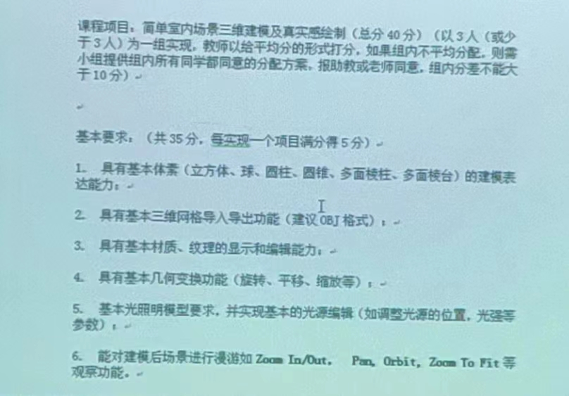
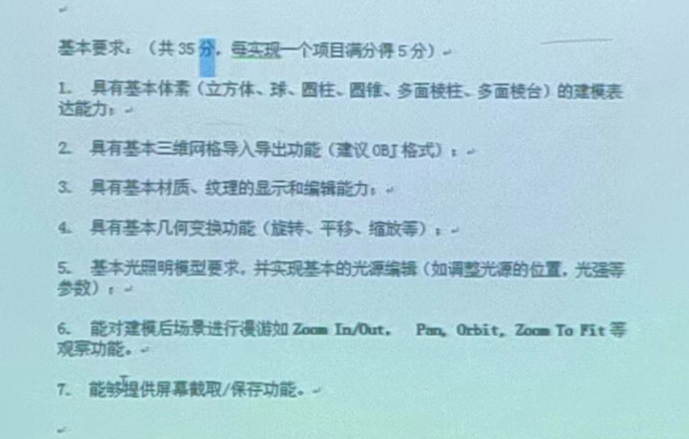
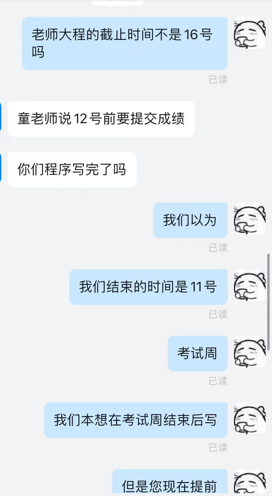
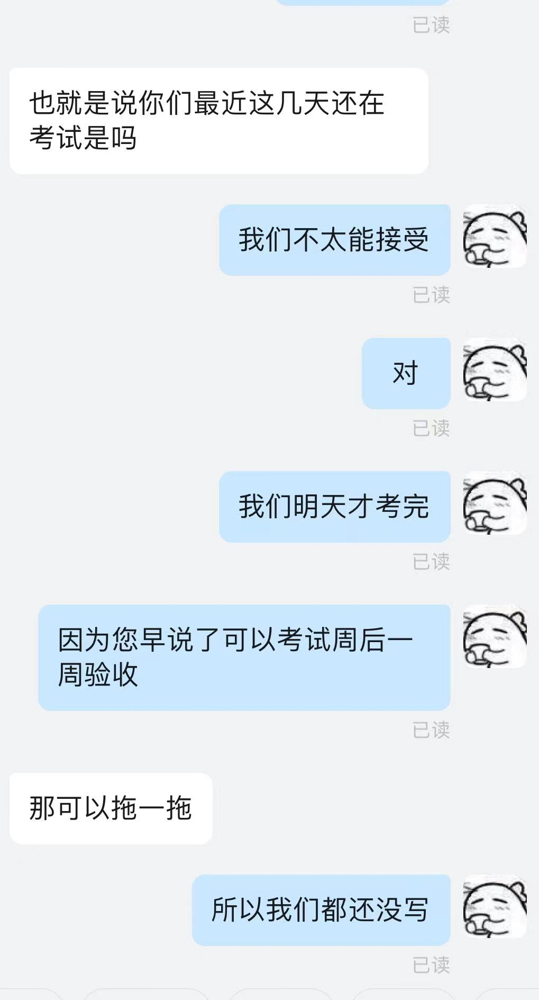
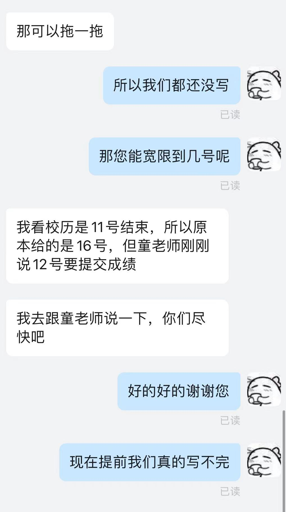
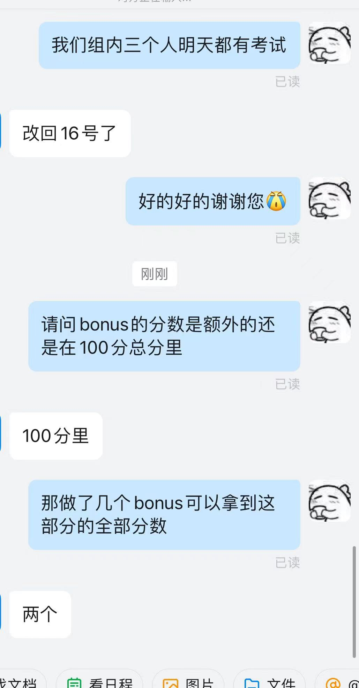

# 计算机图形学

## 课程评价

推荐程度：⭐⭐⭐⭐（不擅长coding则⭐）

这课学到的**所有东西**都来自于你作业看的[OpenGL教程](https://learnopengl-cn.github.io/)

上课的东西（一些图形学最最基础的算法）我的评价是非常有用，特别是GIS和之后想要从事CV、CG方向研究的同学。但是我们**完全没有加以实践**，导致我们上了一学期只是基本掌握了OpenGL代码的编写

老师评价：⭐⭐

trf老师，emm，他上课希望人回答问题，会记录回答问题的次数并算分，怎么算的未知，上课水平一般，其他参见查老师

老师最值的吐槽的一点就是助教和老师**完全互不通信**，助教只管实验，不知道老师上课干了什么，也不知道老师布置了什么作业，更不知道老师怎么打分的

上课会有**以点名为目的的quiz**，但是似乎他也很在乎你的正确率

平常作业量：⭐⭐⭐⭐

Homework：开学老师在学在浙大放了大概七八个作业，是上课理论相关的，但实际上他自己并**不知道自己放了几个**，理论上只用做他自己上课提到过的作业（我是全部做了），每个参照ppt大概20分钟左右可以做完

Lab：

- 6个普通的lab，大概你参照OpenGL教程就可以做完，除了Lab1我大概用了一下午去熟悉，剩下的每一个都没有超过一个小时

- bonus：有六个可选项，请注意，虽然它叫《bonus》，但是**没做的同学是扣了分的**，**做两个才满分**，每一个的**难度都非常非常大**（bonus6居然是实现光追），没有充足空闲建议放弃，每一个我在大佬的帮助下都花费了一整天才完成

- 大程：从2022年开始该课程的大程序有两个选择：

  - 传统图形学方向：即老大程，实现一个程序完成如下给分点：

    

    

    （为什么只有这么多电子包浆的图呢？一件有趣的事情就是老师在上课展示的word是我们**唯一一次看到大程要求**，并没有上传到网络上，**助教也没有**？？？）

    优点：可以缝合lab和bonus的代码，给分非常明确而且是由助教判分，只要你**按点完成，那就能得满分**

    缺点：大概要写数千行代码

  - 新大程：训练模型实现指定风格的图片生成

    优点：需要写的代码应该是相当少的

    缺点：**由AI打分**，谁知道会给你打几分

  大程由我solo（其他两位同学有别的事）大概耗费3个通宵完成，整体不难，ddl基本上是考试周之后

考试难度：没考试

成绩构成：30%老师给分+30%lab+40%大程序

## 资料

我放上我所有的**实验报告**，想要源代码请邮箱[联系我](mailto:chenjiewei@zju.edu.cn)

大程是[开源](https://github.com/jwimd/CG-Project-China-Master)的

## 课程趣逝（bushi

