# 实验报告

## 1 全球气候时空演变

### 1.1 长时序全球海表温度数据集的检索与可视化

阅读文档，了解实验基本过程和原理

逐个加载全球海表温度数据集。加载过程如下图所示

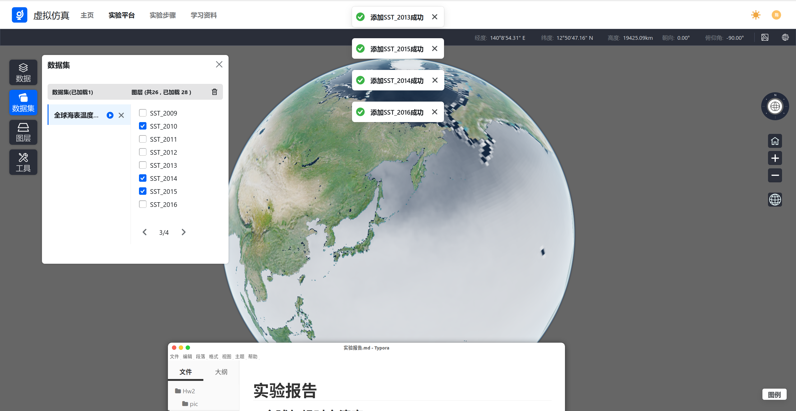

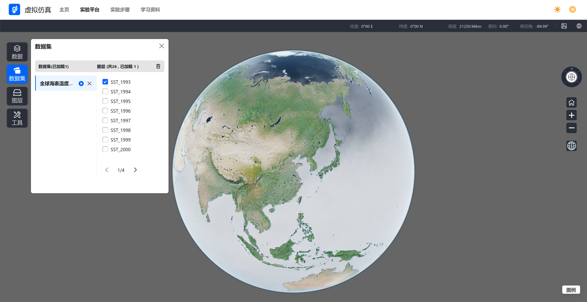

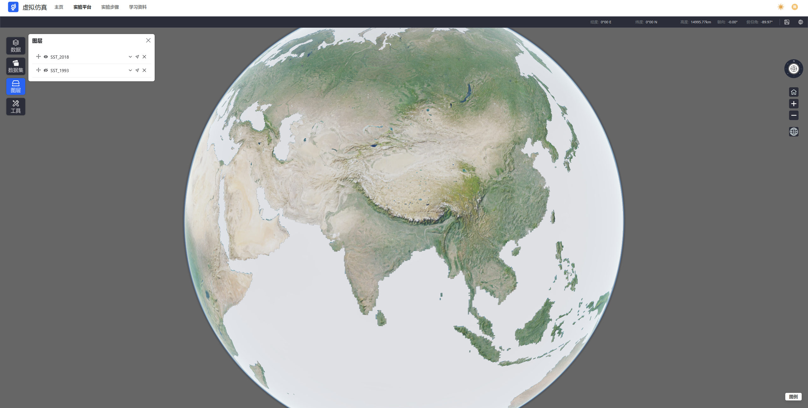

将这两个数据进行目视大致对比，可以发现，最近30年内，两极地区的海表温度变化较大，海温上升明显，而低纬度地区的海表温度变化相对不大。

### 1.2 长时序全球海表温度时空演变过程模拟

使用播放功能，播放全球海表温度数据集随年份的变化情况，如下图所示

随动画播放可以发现如下特征：

- 三十年内，海洋温度整体呈现动态变化的上升趋势
- 在这三十年内，两极地区的温度上升幅度整体上比赤道等低纬度地区大，即水温较低的地区海温上升更加明显

### 1.3 长时序全球海表温度统计信息图表绘制

依照第二部分的探究，考虑海表温度受纬度的影响，选取赤道、低纬度地区、温带中纬度地区和极地地区四个兴趣点进行研究，同时控制经度近似不变：

结果如下图所示

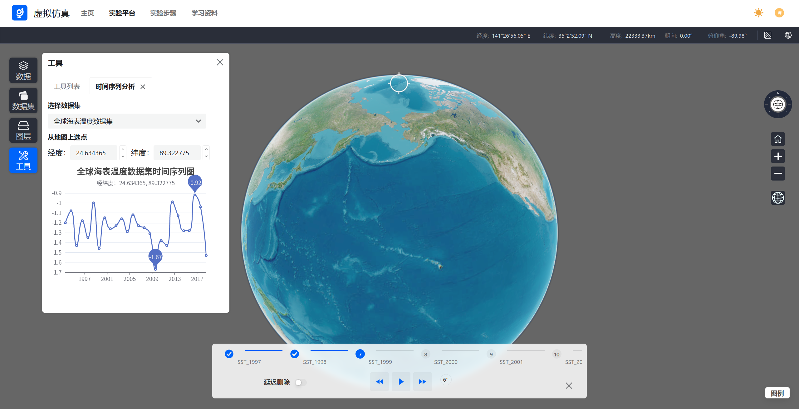

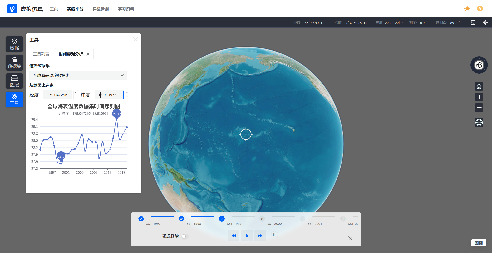

从上述时间序列图中，对于沿纬度分布的全球海温变化可以大致得出以下结论：

- 除赤道地区外，全球海表温度普遍呈现上升趋势
- 上升的幅度随纬度增大而增大，极地地区最大，赤道呈现动态平衡，而极地地区涨幅在2摄氏度左右
- 同时海温的波动幅度也在上涨，海水温度近年来呈现不稳定的特性

原因分析如下

- 全球海表温度上升趋势：除赤道地区外，全球海表温度普遍呈现上升趋势。这可能是由于全球气候变化引起的。大量科学研究表明，人类活动导致的温室气体排放，如二氧化碳等，加剧了地球的温室效应，导致气温上升。
- 温度变化随纬度增大而增大：随着纬度的增加，海表温度上升的幅度也增大。这是因为赤道地区接收到的太阳辐射较多，温度已经相对较高，因此其温度变化较小。而在极地地区，太阳辐射较弱，海冰的消融速度加快，海水温度上升幅度较大。
- 海温波动幅度增加：根据时间序列图，近年来海水温度呈现不稳定的特性，波动幅度增加。这可能是由于气候变化引起的复杂交互作用。全球气候变化导致海洋环流和气候系统发生变化，从而对海温产生影响。此外，自然因素如厄尔尼诺-南方涛动（ENSO）也可能对海温波动起到一定作用。

同时海洋温度变化也可能受离岸边远近的影响，如下图：

在靠近暖流岸边的地区海温波动相对更小，在靠近寒流岸边的地区海温波动相对更大。近岸地区通常受到近岸海洋环流的影响，如海岸流、冷暖海流等。同时陆地上的海风、河流和地下水流等可以影响海水的温度。

同时洋流等因素携带海水导致相同经纬度的不同地区在海温变化上存在分异。

## 2 海洋生态环境时空演变

### 2.1 长时序叶绿素浓度数据集检索和浏览

加载叶绿素浓度数据

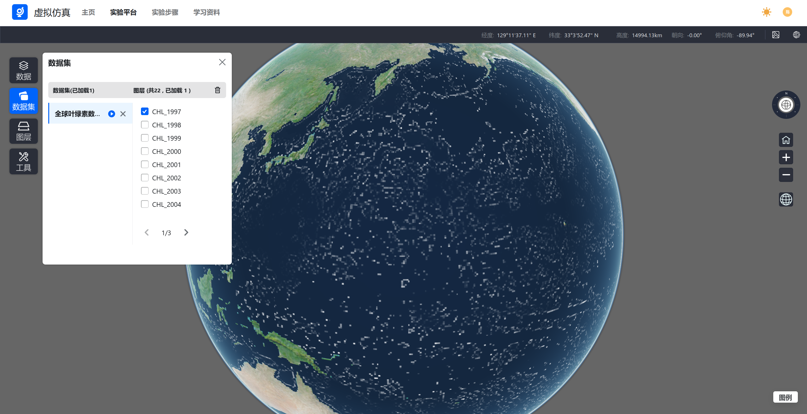

并进行叶绿素浓度变化播放

再利用时间序列分析进行系统分析

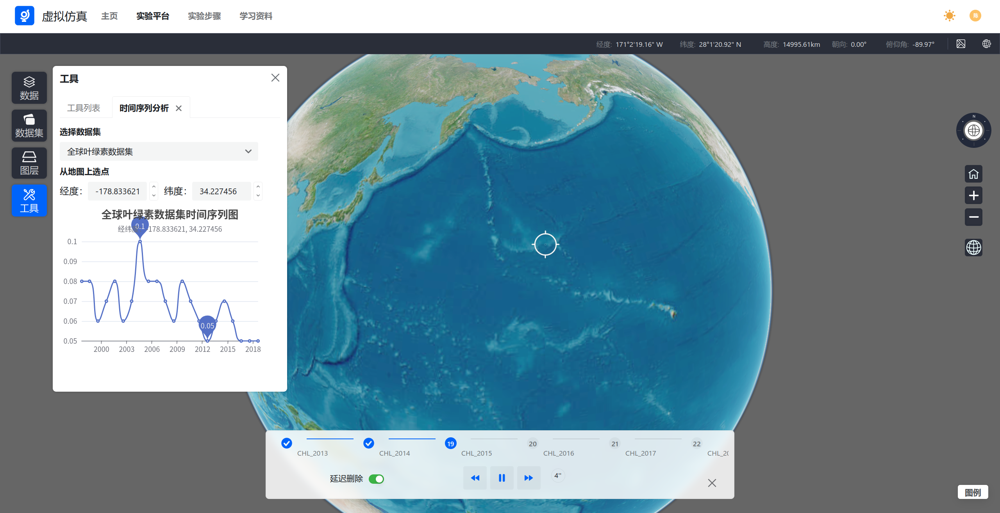

得出全球叶绿素浓度变化规律

- 全球叶绿素浓度变化较为平稳，大洋中部的变化相较于近海岸较大。推测可能与生态环境稳定性有关，这些地区的绿色植物生态群落较为脆弱，容易受到环境变化的影响。
- 从分布来讲近海岸地区的叶绿素含量通常较高。地区通常接收来自河流和陆地输入的养分。河流带来的沉积物和溶解有机质等营养物质可以促进叶绿素的生长。同时浮游植物也更倾向于在近海岸地区生长。
- 高纬度地区叶绿素含量普遍更高，波动也更大。推测在高纬度地区，夏季的日照时间更长，光照强度更高。这提供了更充足的能量供给，促进了浮游植物的光合作用和生长。由于夏季光照条件的改善，高纬度地区的叶绿素含量相对较高。同时水温通常较低，这有利于保持养分的稳定性和浮游植物的生长。此外，高纬度地区还存在冰川融水和冰藻等输入，这些进一步促进了叶绿素的增长。

### 2.2 长时序水体透明度数据集检索和浏览

加载水体透明度数据

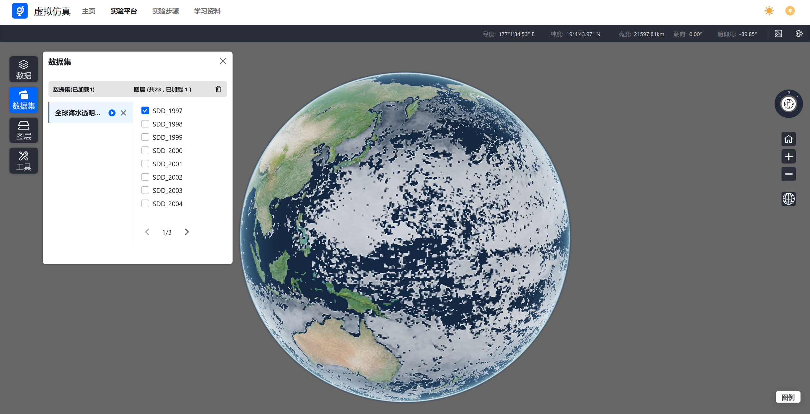

并进行水体透明度变化播放

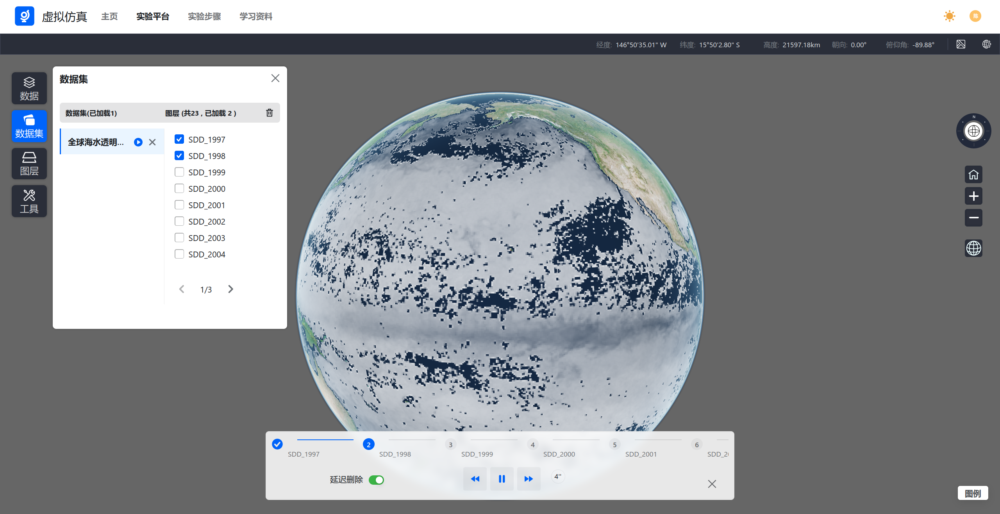

最后利用时间序列分析进行系统分析（选取和叶绿素浓度相同地区）

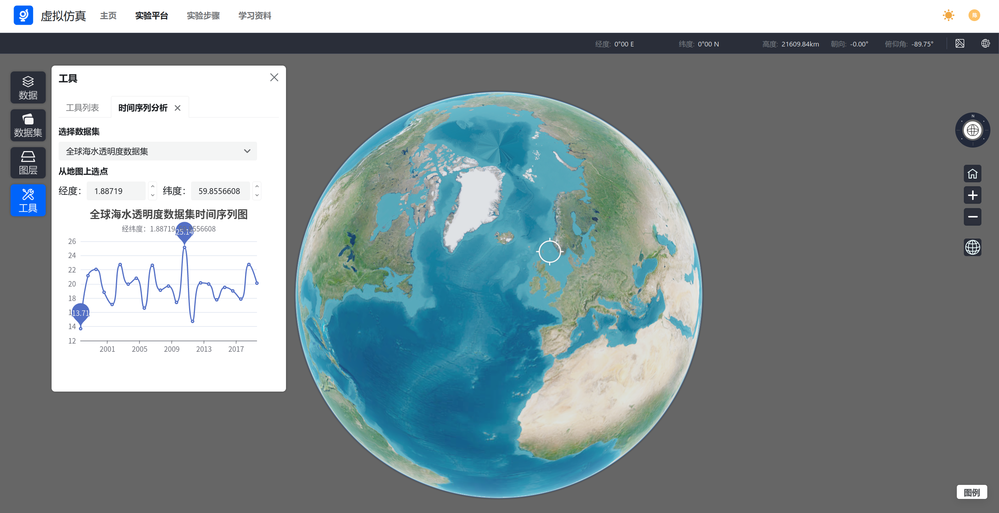

分析全球海水透明度变化趋势：

- 全球海体透明度呈现平稳变化趋势，大洋中部的变化相较于近海岸较大。远离陆地的大洋中部较少受到河流和陆地输入的影响。同时大洋中部的生态系统相较于近海岸地区更加不稳定，年变化较大。光照条件、海洋环流等因素也具有重要的影响
- 海水透明度变化与海水叶绿素浓度变化整体呈现反比趋势，叶绿素含量高的区域透明度低。这是因为叶绿素含量高意味着浮游生物多，浮游生物多必然会导致水体透明度下降。
- 极地地区的海水透明度更高，与温度低浮游生物难以生长有关，同时冰川融雪也会净化海水
- 通常河流入海口附近海水透明度较低，比如中国的长江三角洲附近

### 2.3 长时序海洋生态环境评价

使用【海洋生态环境等级计算】工具，以叶绿素数据集为标准，设置0.00、0.25、0.50、0.75、1.00、1.25作为间断点，由于叶绿素含量越高代表水质越不好，所以叶绿素含量越高的地区颜色越红，否则颜色越绿。

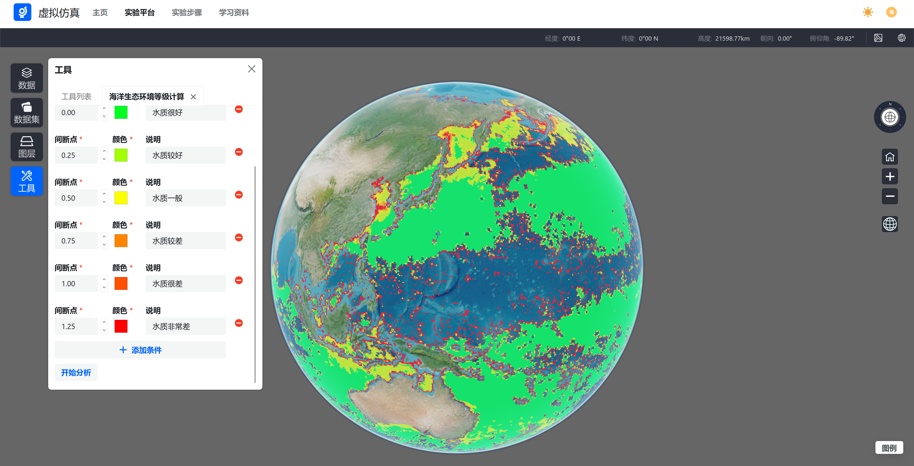

选取点位进行时间序列分析

首先选取我国近海岸长江三角洲地区进行分析

我国近海岸地区，尤其是大河入海口地区的水质普遍较差，主要影响因素是河流携带的大量泥沙等污染物，同时靠近海边的地区水体富营养化导致绿色植物生长。同时随年份变化明显，这取决于当年的气候和政府对污染物排放的管控力度。

选取中纬度太平洋中部地区分析

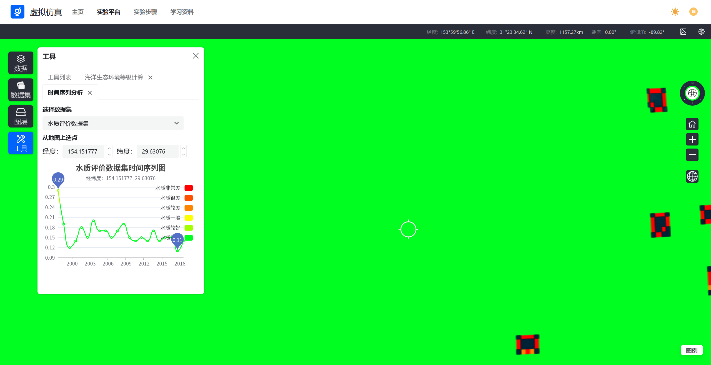

这些远离大陆的地区浮游植物少，水体清澈，生态评级高。生态评级常年变化不大。

选取高纬度格陵兰岛地区分析

高纬度地区的水质评级逐年恶化。首先高纬度地区更容易受到全球气候变化的影响。气候变化导致海洋温度上升、海冰减少、海洋酸化等问题，这些变化对海洋生态系统和水质产生重要影响。同时高纬度地区的冰川和海冰融化加速，这会导致冰融水的混入海洋，带入了营养物质和有机物质，可能引发营养盐过剩和藻类过度生长。

## 3 人类活动时空演变

### 3.1 长时序土地覆盖数据集检索和浏览

加载斐济地区土地覆盖数据集

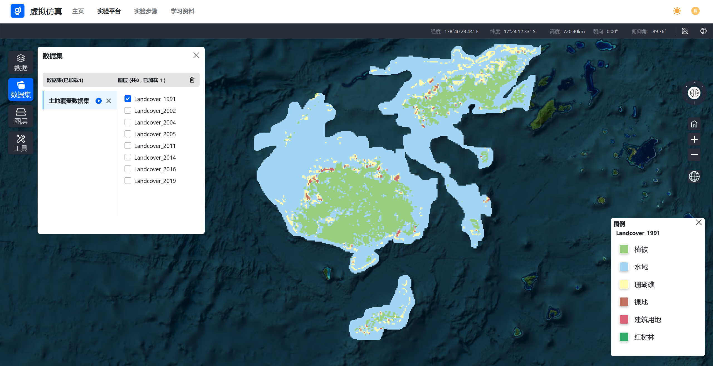

利用播放功能观察斐济地区土地覆盖数据变化

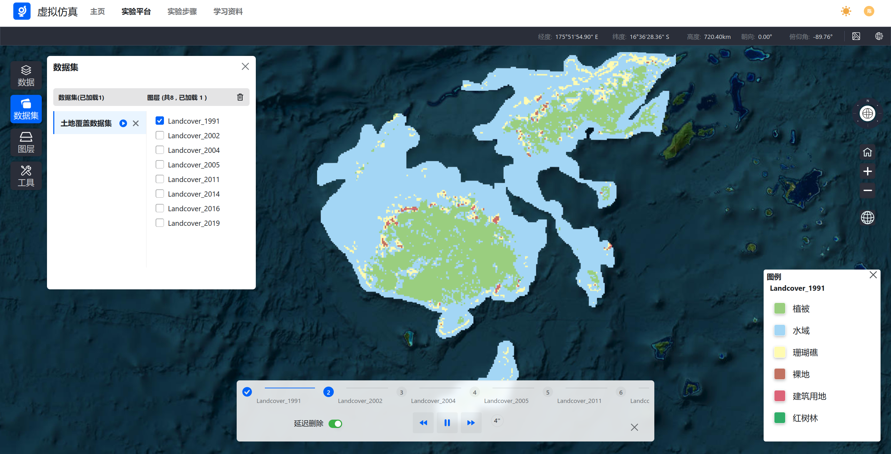

可以总结在30年内斐济土地覆盖面积的变化

- 30年内裸地和建筑用地的面积逐渐扩大，与此同时植被的面积相应缩小，这是人类活动和城市建设的拓张造成的，是斐济30年来经济发展的体现
- 珊瑚礁面积动态增加，来自河流或其他陆地源的泥沙，沉积物可能会堆积在珊瑚礁上。珊瑚礁的生长和面积变化受到多种环境因素的影响，包括水温、水质、光照等。此外，人类活动对珊瑚礁的破坏和保护也是影响其面积变化的重要因素。
- 水域拓张。全球气候变化导致海平面上升，这是海岸后退的主要原因之一。海平面上升导致海水侵蚀海岸线，特别是低洼和脆弱的海岸地区更容易受到影响。斐济作为一个太平洋岛国，其部分地区的海岸线受到海平面上升的威胁，导致了海岸后退。

### 3.2 长时序土地覆盖时空演变过程模拟

利用时间序列工具进行分析

这幅图展示了斐济地区近海岸人类活动的拓张，大量地区由植被转化为裸地和建筑用地

斐济的红树林保护较好，30年来只有少量地区被水体淹没或者遭到砍伐变为裸地，这些红树林为阻挡海岸线后退起到了重要作用

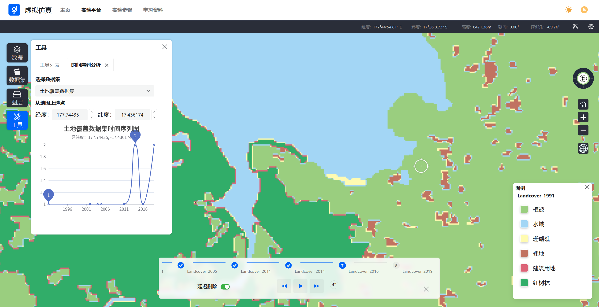

有些地区随着海平面上升，被海水淹没

总结斐济土地利用特点如下

- 斐济的土地利用类型主要以水域为主，植被为辅，剩余地区绝大多数为裸地和珊瑚礁。其中植被主要集中在东南部和东北部；裸地主要集中在与植被相邻的近水位置。
- 斐济受海平面拓张影响较大，近年来海岸线后退的现象较严重。
- 随着斐济人类活动的影响，斐济的植被有所减少，而珊瑚礁有所增加。

### 3.3 长时序土地覆盖统计信息图表绘制

为了对上述结论进行验证，使用土地利用分类工具绘制土地利用情况按时间变化的统计图。参数设置如下

最终结果如下：

根据上述图表和土地利用时空演变动图，可以得出以下结论：
- 斐济地区的土地覆盖以水域为主，其次是植被，非水域和植被的土地基本上以裸地和珊瑚礁为主。近年来随着斐济地区的开发，植被逐渐减少。近岸地区是适合人类居住的地区，这些地区由于人类的开发，原有的植被和红树林转变为裸地和建筑用地，但是如今保护措施仍然很好，整体变化不大。大陆架地区以珊瑚礁为主，近年来随着珊瑚礁保护政策的实施以及河流的泥沙堆积，珊瑚礁覆盖率逐渐上升。
- 从图中可以看到，水域面积基本上变化不大，但是海岸线有所后退，河流旁形成新的裸地，植被覆盖面积以2014年为界，2014年之前逐渐减少，2014年之后逐渐增加，这可能与某些保护植被的政策，如植树，退耕还林的实施有关。

本节的结论与前两节有所不同，提示我们要使用多个分析方法才能够得出较为完善的结论，单一地点、单一时间的观察所得出的结果很可能是不完善的。

## 4 海平面上升模拟

### 4.1 全球平均温度-海平面模型

利用海平面上升模拟工具，设定地形为Cesium全球地形

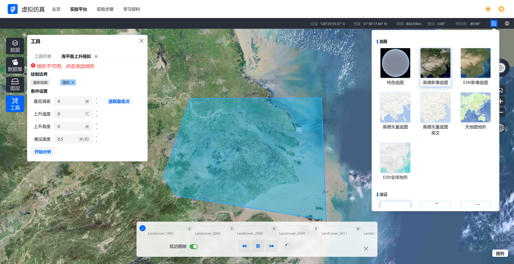

同时选定上海市为探究地区

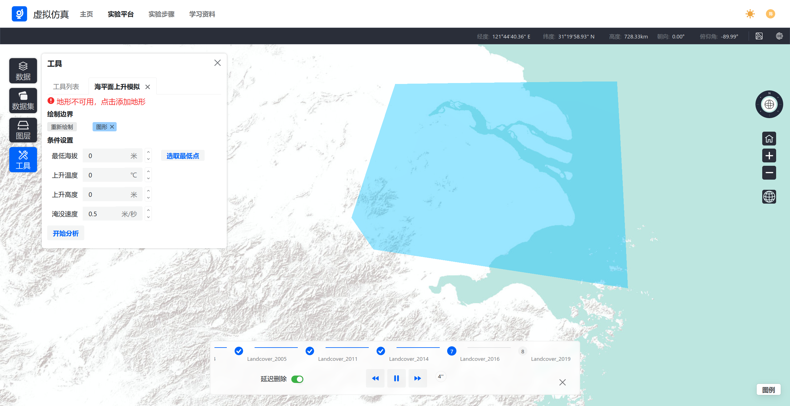

温度每上升一度，海平面上升6.33米。

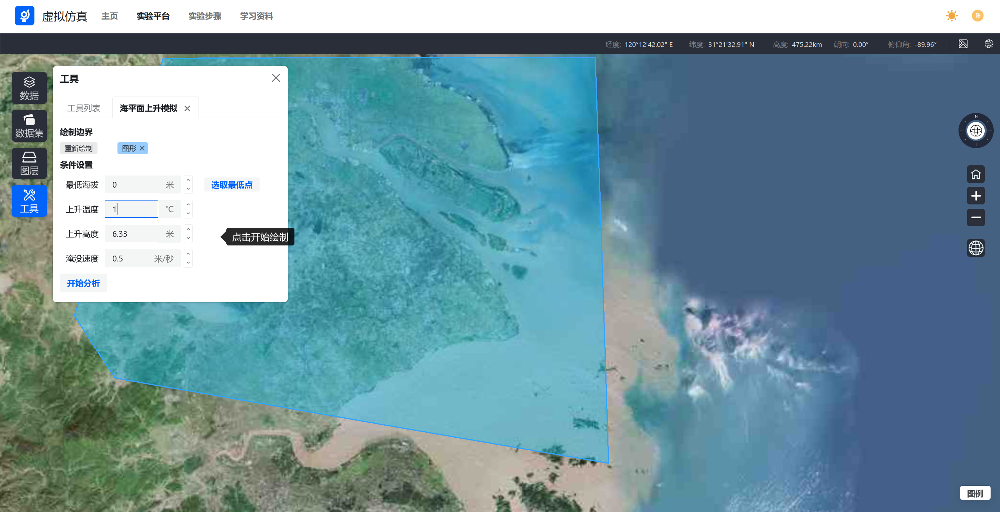

### 4.2 海平面变化过程仿真模拟

进行海平面上升模拟，分别使温度上升5℃，10℃，15℃，模拟海平面上升的淹没过程如下图

这是上升10度的淹没结果

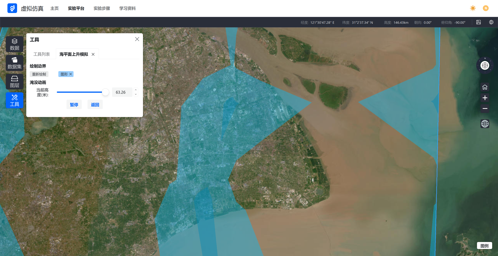

通过分析随温度上升的淹没结果有如下结论：

- 全球气温上升会导致海平面上升，当气温上升十度左右的时候，上海主城区大部分地区将被海水淹没，上升20度时，整个上海都将不复存在，全球变暖对我国沿海地区城市有毁灭性的打击
- 在淹没过程中，首先被淹没的是海拔较低的黄浦江沿岸地区和崇明岛地区，随着海平面的上升，其他地区也逐渐被淹没。
- 海平面上升的影响不仅是简单的淹没陆地，海平面上升导致海水温度升高，这对海洋循环和气候模式产生重要影响。温暖的海水可以加强海洋环流，改变海洋表面温度分布，进而影响大气环流模式。这可能导致气候模式的变化，如降雨分布的改变、风向和风速的变化等。同时增加了海岸线受到风暴潮和洪水的威胁。温暖的海水为风暴和飓风提供了更多的能量，可能导致风暴潮更加强大和具有更大的冲击力。此外，海平面上升还可能增加降雨和洪水的风险，对沿海和河口地区造成更严重的影响。
- 全球气候变暖导致的气候变化和冰川融化是导致海平面上升最主要的原因。减少碳排放，减缓温室效应是每一个人应尽的义务。

## 5.碳通量时空过程仿真

### 5.1 海洋碳通量计算模型

加载全球碳通量数据集如下图

### 5.2 海洋碳循环时空演变过程模拟

使用碳通量模拟工具，设置合适参数，对多个不同区域（包括中国印度等发展中国家、欧美等发达国家、极地地区、热带雨林地区）碳通量可视化，参数设置和模拟效果如下图所示

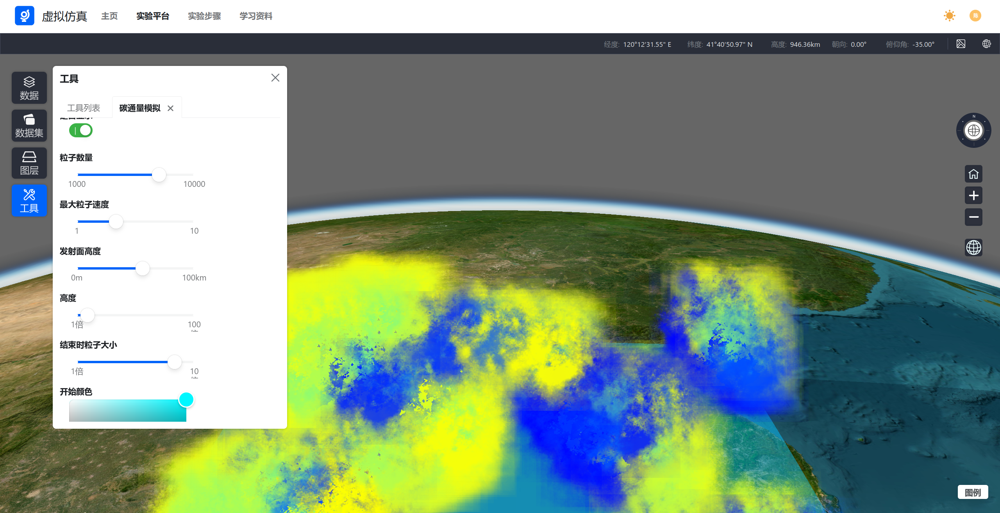

根据模拟有如下结论：

- 中国和印度等发展中经济体：由于工业化和经济增长的快速推动，中国和印度等发展中经济体的碳排放量在过去几十年中大幅增加。这些地区的能源需求和化石燃料消耗量大，导致了高水平的二氧化碳排放。
- 欧洲和北美地区：欧洲和北美地区相对较早实施了减排政策和采用了清洁能源，因此在一些地区碳排放量出现了一定的下降趋势。许多国家和地区采取了措施来减少化石燃料的使用，提高能源效率，并逐渐推广可再生能源。
- 热带雨林和森林地区：热带雨林和森林地区通常具有丰富的植被和生物多样性，它们在固定大量的二氧化碳方面发挥着重要作用。然而，由于森林砍伐、土地利用变化和森林火灾等因素，一些热带雨林和森林地区的碳储量受到威胁，可能导致碳排放增加。
- 极地地区：极地地区的碳通量变化受到气候变化和冰盖融化的影响。随着极地地区冰盖和冰架的快速融化，大量的冰水进入海洋，可能导致碳释放增加。此外，极地地区的温度升高也可能影响生态系统的生物固碳能力。

目前关于碳通量我们可以得出如下结论：

- 中国是全球最大的碳排放国之一，其碳通量情况非常严重。根据国际能源署（IEA）的数据，中国在2019年的二氧化碳排放量为10.17亿吨，占全球总排放量的28.8%。这个数字比排名第二的美国多出两倍以上。中国的碳通量主要来自于工业和能源部门的排放。工业部门的碳排放占全国总排放量的30%左右，能源部门的碳排放占总排放量的70%左右。这警示着我们每一个中国人，减少碳排放是我们每一个人的责任。

- 碳通量增加的原因有如下几点：化石燃料燃烧、森林砍伐和土地利用变化、工业过程和生产、火山喷发等天然过程

- 碳通量增加会造成如下危害：导致全球气候变化，增加的温室气体导致地球大气层中的热量滞留，加剧了地球的温室效应，导致气温升高。气候变化引发了极端天气事件的增加，包括热浪、洪水、干旱和飓风等，对生态系统、农业、水资源和人类健康等产生广泛影响。全球气候变化导致冰川和冰盖的融化，以及海洋水体的热膨胀，使得海平面上升。气候变化和碳通量增加对人类健康产生直接和间接的影响。极端气候事件引发的自然灾害和生态系统破坏会导致人员伤亡和健康风险增加。

  